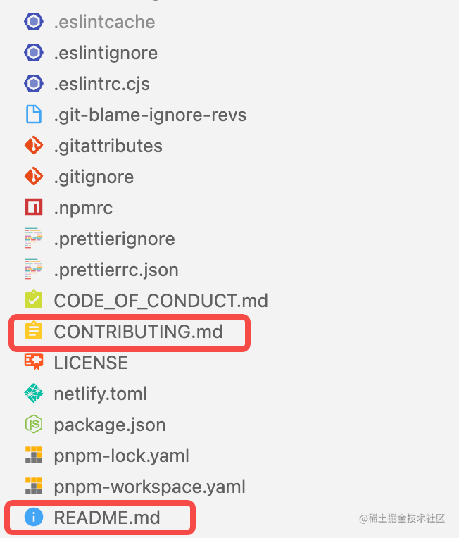
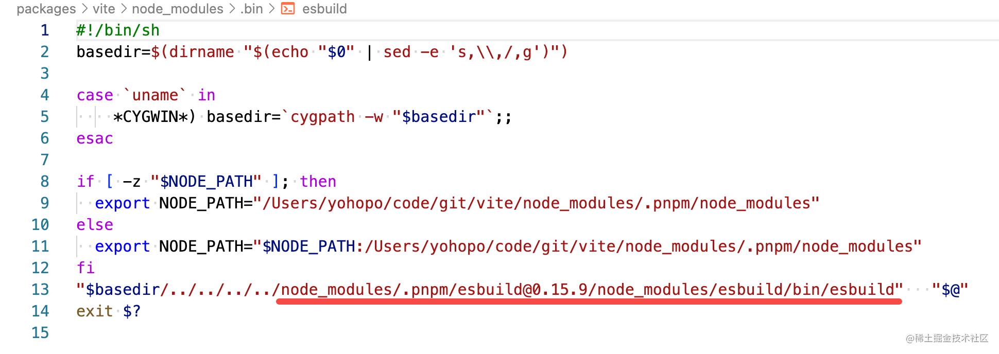
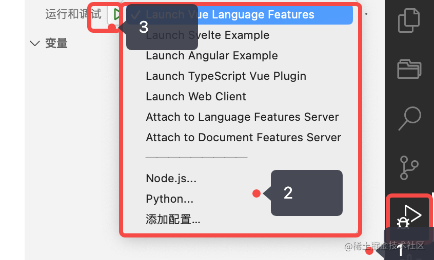
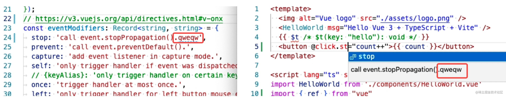

# 前端源码调试技巧

最近在研究开源项目代码，但是看了两天感觉自己天天在摸鱼，没看一下就走神，今天实在忍不住，总结了下看大仓库源码必须要先跑起来，跑不起来就别看，纯浪费时间，记录一下这一年以来我调试源码的技巧。

## 贡献文档

有些项目会有一个贡献指南`CONTRIBUTING.md`，有些项目的贡献指南写在`readme.md`里面，稍微困难点的开源项目应该都会有一个贡献指南，很多时候答案就写着这些文档里面。




## package.json

在打开一个项目之前，一般我会先装包，把项目的`dts`下载下来，这样项目的ts文件就可以跳转了，并且ts代码提示就可以跑通。

```shell
pnpm i
```

然后`package.json`作为最开始的入口，看一下`package.json的scripts`能猜猜作者是怎么调试的。

以`vite`为例。

```json
{
  "scripts": {
    "preinstall": "npx only-allow pnpm",
    "postinstall": "simple-git-hooks",
    "format": "prettier --write --cache .",
    "lint": "eslint --cache .",
    "typecheck": "tsc -p scripts --noEmit && pnpm -r --parallel run typecheck",
    "test": "run-s test-unit test-serve test-build",
    "test-serve": "vitest run -c vitest.config.e2e.ts",
    "test-build": "VITE_TEST_BUILD=1 vitest run -c vitest.config.e2e.ts",
    "test-build-without-plugin-commonjs": "VITE_TEST_WITHOUT_PLUGIN_COMMONJS=1 pnpm test-build",
    "test-unit": "vitest run",
    "test-docs": "pnpm run docs-build",
    "debug-serve": "VITE_DEBUG_SERVE=1 vitest run -c vitest.config.e2e.ts",
    "debug-build": "VITE_TEST_BUILD=1 VITE_PRESERVE_BUILD_ARTIFACTS=1 vitest run -c vitest.config.e2e.ts",
    "docs": "vitepress dev docs",
    "docs-build": "vitepress build docs",
    "docs-serve": "vitepress serve docs",
    "build": "pnpm -r --filter='./packages/*' run build",
    "dev": "pnpm -r --parallel --filter='./packages/*' run dev",
    "release": "tsx scripts/release.ts",
    "ci-publish": "tsx scripts/publishCI.ts",
    "ci-docs": "run-s build docs-build"
  },
}
```

我看的前端项目大部份都是menorepo，以我的经验，有的代码库会将自己bundle的输出作为脚本，在日常中使用，并且作为menorepo，每个模块build出来产物的dts也可以给其他模块提供代码提示。

所以我会想把仓库构建一次。

```shell
pnpm build
```

### 命令行启动

构建完之后大概项目应该就可以跑起来。因为vite是一个nodejs命令行项目，本身就有一个vite`命令`去启动，所以接下来就看`package.json > bin`，看一下项目的命令运行的是哪个js文件。

```json
{
  "bin": {
    "vite": "bin/vite.js"
  },
}
```

如果根目录的`package.json`找不到`bin`字段可以在vscode上全局搜一下，如果还是找不到，应该就是他的命令行不在当前的库当中，可以去`node_module/bin`下面看下具体指令执行的具体包，然后看他的`package.json > repository` 找到命令正确的仓库位置。



### 包

如果你看的代码他不是一个命令行，他是一个包，他是有编程模式的引用方式，那应该看的是项目默认导出的文件`package.json > exports` / `package.json > main`，就可以定位到具体使用包里面的js。

因为定位到的一般都是一个构建后的文件，我们就应该看构建脚本来确定这个文件的`input`是什么文件。

### 单元测试

在确定完入口之后，代码是可以跑起来的，但是代码的意图困难需要很多上下文才能理解，看注释是一个办法，另一个办法就是看单元测试了。

所谓的单元测试就是把某个js函数，在nodejs环境下提供可运行的依赖，然后让这个函数用不同的输入跑，看看能不能命中预期的输出。根据这个特点，基本上可以断定作者这个函数的意图和复杂的边界情况。

以vuejs为例，以下测试就是测试`computed`函数在依赖改变后，`computed`的值会跟着改变。

```ts
  it('should return updated value', () => {
    const value = reactive<{ foo?: number }>({})
    const cValue = computed(() => value.foo)
    expect(cValue.value).toBe(undefined)
    value.foo = 1
    expect(cValue.value).toBe(1)
  })
```

### e2e测试

e2e测试比单元测试，对代码的理解帮助就少很多，e2e测试并不能关注代码的细节，但是一个庞大的软件会有很多逻辑分支，有些时候这个仓库做的事情可能就是一些资源整合，这时候整体功能测试比单元测试的意义要大。

## .vscode

如果项目有[.vscode/tasks.json](https://code.visualstudio.com/docs/editor/tasks)文件，那这个项目有默认的构建任务，可以执行下来试试水，一般是提供方便的。

但是如果项目有[.vscode/launch.json](https://code.visualstudio.com/docs/editor/debugging)文件，那这个项目配置了调试功能，以volar为例，按照下面步骤操作一波后就跑起来了。




最后附上我成功运行volar的截图。



