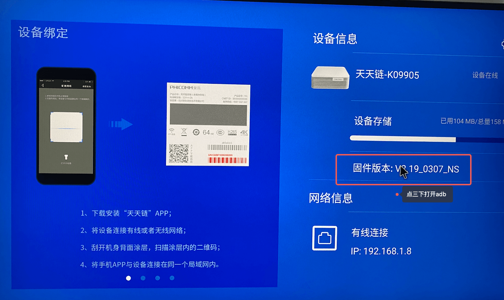
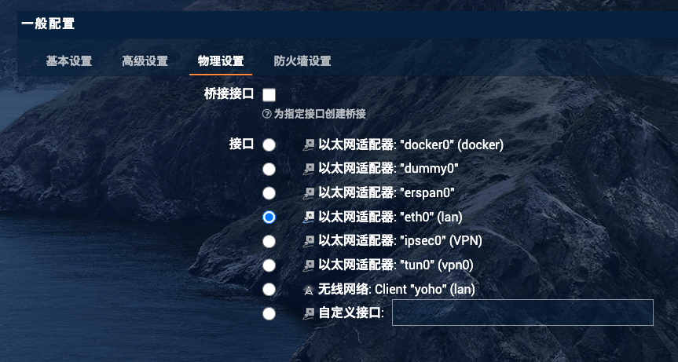
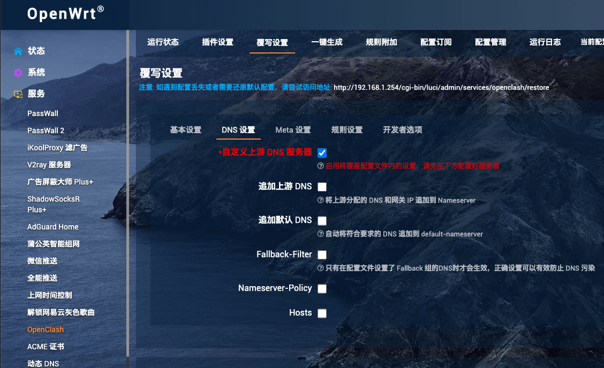
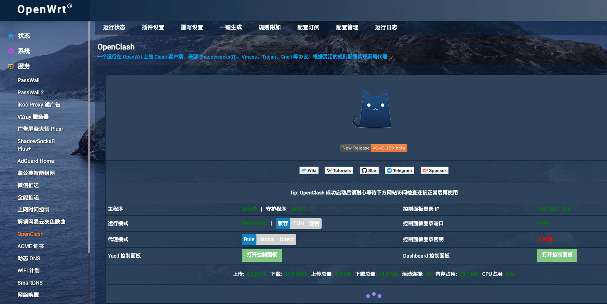
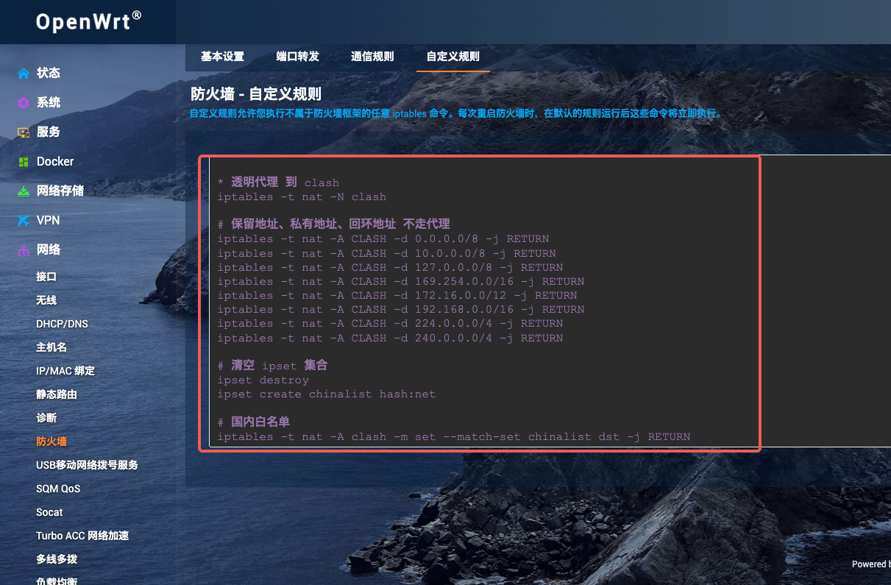

# 菲讯n1刷openwrt

## 刷固件

### 降级

如果n1盒子的版本>2.22，使用adb连接n1，执行以下命令进行降级，否则跳过该步骤。

1. 打开adb，连接网线和电脑在一个网段，点三下打开adb。




2. 设置设备使用fastboot
```sh
ip=192.168.1.8
adb connect ${ip}
adb shell reboot fastboot
```

>
> 如果不确定设备是否连接上，可以通过下面命令查看电脑连接的设备。
> ```sh
> fastboot devices
> ```
>

4. 使用fastboot刷入低版本的固件。

```sh
fastboot flash boot ./boot.img
fastboot flash bootloader ./bootloader.img
fastboot flash recovery ./recovery.img

fastboot reboot
```

！！！ 执行完命令后，重启盒子，发现显示的版本和原来的一样，其实已经成功刷入了低版本的固件，可以开启u盘启动。

### u盘刷openwrt


### 安装openwrt到eMMC

1. 设置n1 u盘启动

```sh
ip=192.168.1.8
adb connect ${ip}
adb shell reboot update
```

2. 连接n1的wifi
   * ssid: Phicomm_n1
   * password: password
3. 打开浏览器访问`openwrt`的设置页面
   * http://192.168.1.1 
   * user: root 
   * password: password 
4. 执行安装到eMMC命令安装openwrt到n1。

> 刚刚开机可能没有准备好入口，等一下就有了。


## 配置旁路由

旁路由的意思就是通过路由表的配置，让主路由的流量都过一次旁路由，然后旁路由做一层网关处理流量。

```text
before:

主机 -> 主路由 -> internet


after:

主机 -> 旁路由 -> 主路由 -> internet
```

1. 首先配置旁路由的路由策略。


2. 配置dhcp服务器强制网段下的机械都使用旁路由的dhcp，配置网段内的流量都打到旁路由。


> 3,xxx.xxx.xxx.xxx 表示dhcp下的设备的路由为192.168.1.254
> 
> 6,xxx.xxx.xxx.xxx 表示dhcp下的设备的dns为192.168.1.254

3. 配置接口使用的物理端口



4. 配置接口使用防火墙


5. 配置防火墙规则


```text
iptables -t nat -I POSTROUTING -j MASQUERADE
```


6. 重启`n1`，重新连接wifi，让设备使用`n1`的dhcp服务。


## 配置openclash

因为内网规则比较复杂，使用clash配置规则降低复杂度。n1的openwrt固件里面带有openclash，直接点启动就好。

注意配置clash的订阅网址。


配置dns



启动成功的样子



配置好clash的规则需要配置n1进行「透明代理」。




```text

# 透明代理 到 clash
iptables -t nat -N clash

# 保留地址、私有地址、回环地址 不走代理
iptables -t nat -A CLASH -d 0.0.0.0/8 -j RETURN
iptables -t nat -A CLASH -d 10.0.0.0/8 -j RETURN
iptables -t nat -A CLASH -d 127.0.0.0/8 -j RETURN
iptables -t nat -A CLASH -d 169.254.0.0/16 -j RETURN
iptables -t nat -A CLASH -d 172.16.0.0/12 -j RETURN
iptables -t nat -A CLASH -d 192.168.0.0/16 -j RETURN
iptables -t nat -A CLASH -d 224.0.0.0/4 -j RETURN
iptables -t nat -A CLASH -d 240.0.0.0/4 -j RETURN

# 清空 ipset 集合
ipset destroy
ipset create chinalist hash:net

# 国内白名单
iptables -t nat -A clash -m set --match-set chinalist dst -j RETURN

# 其他流量走透明代理

iptables -t nat -A clash -p tcp -j REDIRECT --to-ports 7892 

iptables -t nat -A PREROUTING -p tcp -j clash
```

关于上文使用到的资源都在：

* 链接: https://pan.baidu.com/s/1zvKTtCdcNdjwnYjjCywkNw 提取码: bd5t